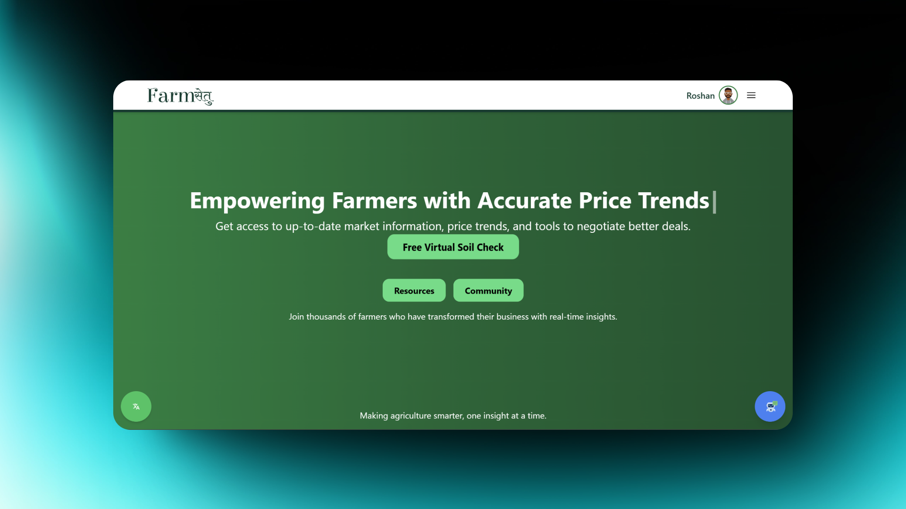
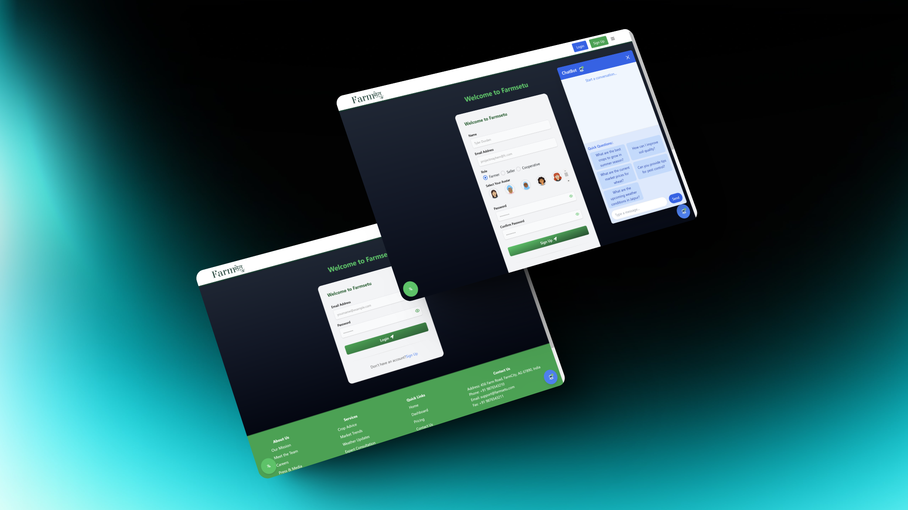
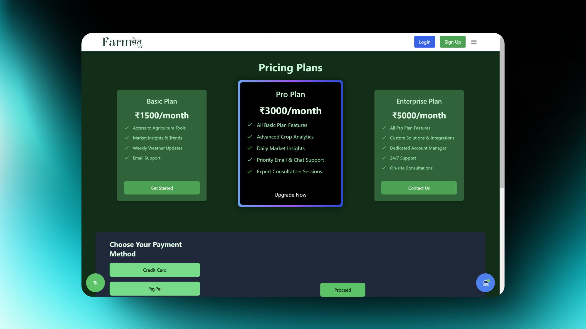
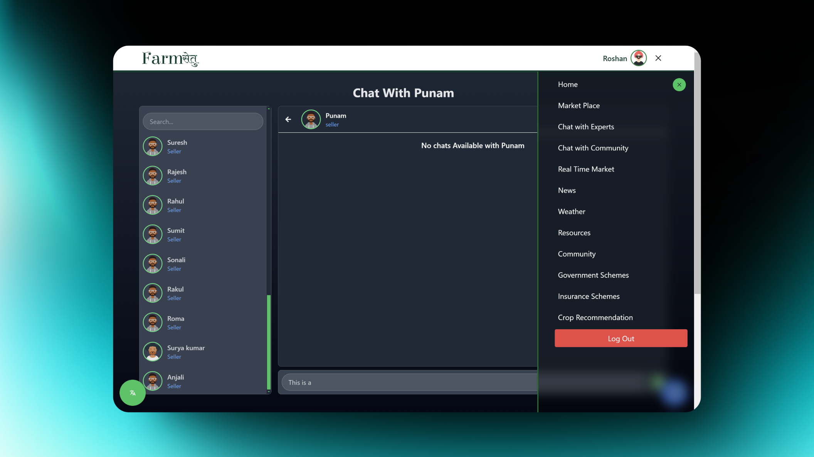
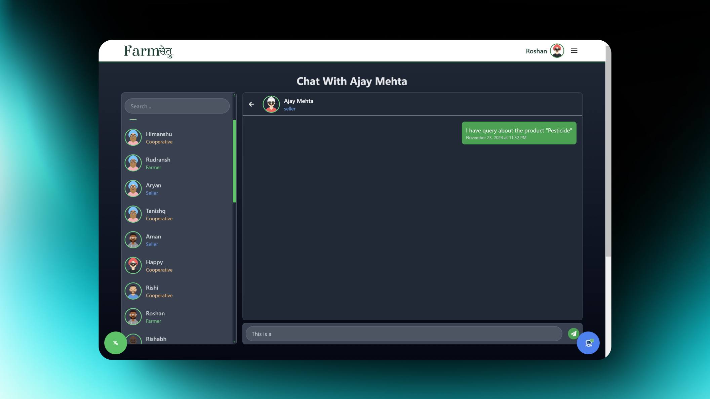
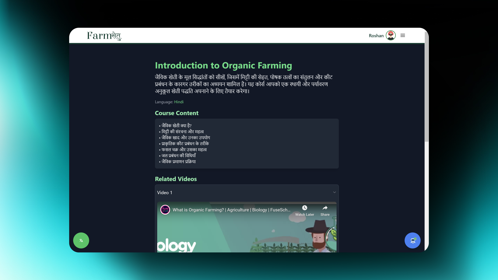
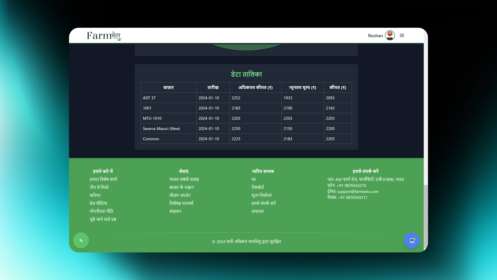

# 🌾 **Farm Setu (सेतु)**

Farm Setu is a revolutionary platform designed to empower farmers by providing easy access to resources, tools, and a vibrant community. With this app, farmers can stay updated on the latest techniques, trade in a specialized marketplace, consult experts, and connect with fellow farmers. The goal? To make farming smarter, more profitable, and deeply connected.

---

## 📖 **Overview**

Farmers worldwide face common challenges: limited information, high costs, and scarce resources. **Farm Setu** bridges this gap by integrating technology with agriculture. The platform delivers real-time data, news, and expert support, enabling farmers to overcome daily challenges with confidence.

Key features include a **Marketplace**, **Community Forum**, **Expert Consultations**, and **Local Chats**, fostering a robust network of shared knowledge and resources.

---
## 📺 **Live Preview**

- **Backend**: [https://farmsetu-6bga.onrender.com](https://farmsetu-6bga.onrender.com)
- **Frontend**: [https://farmsetu.netlify.app](https://farmsetu.netlify.app)


## 🌟 **Features**

- 📢 **Educational News**: Stay informed with regular updates on agricultural news, policies, and innovations.
- 🛒 **Marketplace**: A transparent platform for buying and selling agricultural goods and equipment.
- 💬 **Community Forum**: Share experiences, discuss solutions, and grow together.
- 🧑‍🌾 **Expert Consultations**: Direct chat with agricultural experts for crop, soil, or pest advice.
- 🌍 **Local Network**: Connect with nearby farmers to exchange regional farming tips.
- 🌱 **Crop Data Repository**: Access planting, harvesting, and pest resistance data.
- 📊 **Real-Time Market Data**: Make informed selling decisions based on current crop prices.
- ☁️ **Weather Updates**: Real-time weather data for better crop planning.
- 🤖 **Chatbot Assistant**: 24/7 AI assistant to answer common farming queries.

---

## 💻 **Technologies Used**

- **Frontend**: React.js, Tailwind CSS, JavaScript
- **Backend**: Node.js, Express.js
- **Database**: MongoDB
- **APIs**: OpenWeatherMap, Market Data API

---

## 🖼️ **Preview**










---

## 🚀 **Installation Guide**

### **Prerequisites**

Ensure the following software is installed:

- Node.js
- MongoDB

### **Installation Steps**

1. **Clone the repository**:
   ```bash
   git clone https://github.com/username/farm-setu.git
   ```

2. **Navigate and install dependencies**:
   ```bash
   cd farm-setu
   npm install  # Install Node.js dependencies
   ```

3. **Database Setup**:
   - Start your MongoDB server.
   - Ensure the necessary collections are set up.

4. **API Key Configuration**:
   - Get your API keys from **OpenWeatherMap** and **Market Data API**.
   - Add these keys to the `.env` file.

5. **Run the Server**:
   ```bash
   npm start
   ```

Access the platform at `http://localhost:3000`.

---

## 🧑‍🏭 **Usage**

1. **Create an Account**: Register or log in.
2. **Explore**: Browse news, the marketplace, and the community forum.
3. **Analyze**: Check crop data, market prices, and weather forecasts.
4. **Consult**: Chat with experts or connect with local farmers.
5. **Quick Help**: Use the chatbot for instant assistance.

---

## 🤝 **Contributing**

We welcome contributions! Follow these steps:

1. **Fork the repository**.
2. **Create a new branch**:
   ```bash
   git checkout -b feature/your-feature
   ```
3. **Commit your changes**.
4. **Submit a pull request**.

---

## 📜 **License**

This project is licensed under the **MIT License**. Feel free to use, modify, and distribute it.

---

## 🙏 **Acknowledgements**

- **OpenWeatherMap** and **Market Data API** for real-time data.
- Local farming communities for invaluable feedback.
- Our dedicated team for turning this vision into reality.

---

## 👥 **Team (Strikers)**

- **Ajay Mehta**: Data Scientist  
- **Himanshu Gahlot**: Frontend Developer  
- **Ravi Kant Chaudhary**: App Developer, Data Scientist, UI/UX Designer  
- **Rishab Chaudhary**: Unit Tester  
- **Rishi Soni**: Full Stack Developer, Prompt Engineer  
- **Roshan Suthar**: Full Stack Developer  

---

**Let’s build a sustainable, informed, and connected farming ecosystem! 🌱**
