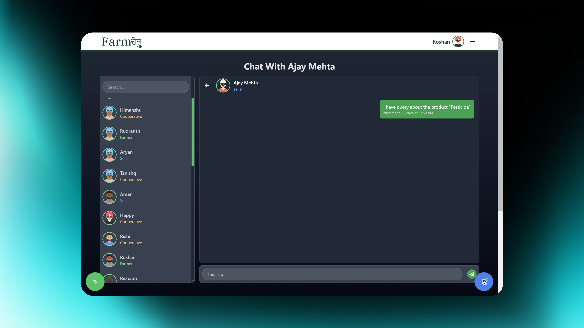

# 🌾 **Farm Setu (सेतु)**

Farm Setu is a revolutionary platform designed to empower farmers by providing easy access to resources, tools, and a vibrant community. With this app, farmers can stay updated on the latest techniques, trade in a specialized marketplace, consult experts, and connect with fellow farmers. The goal? To make farming smarter, more profitable, and deeply connected.

## 📑 **Table of Contents**

- [📖 Overview](#-overview)
- [📺 Live Preview](#-live-preview)
- [⚡ Quick Start 🚀](#-quick-start-)
- [🌟 Features](#-features)
  - [📢 Educational News](#-educational-news)
  - [🛒 Marketplace](#-marketplace)
  - [💬 Community Forum](#-community-forum)
  - [🧑‍🌾 Expert Consultations](#-expert-consultations)
  - [🌍 Local Network](#-local-network)
  - [🌱 Crop Data Repository](#-crop-data-repository)
  - [📊 Real-Time Market Data](#-real-time-market-data)
  - [☁️ Weather Updates](#️-weather-updates)
  - [🤖 Chatbot Assistant](#-chatbot-assistant)
- [💻 Technologies Used 🛠️](#-technologies-used-)
- [🖼️ Preview](#️-preview)
- [📂 Project Structure 🏗️](#-project-structure-)
- [🚀 Installation Guide ⚙️](#-installation-guide-)
- [🧑‍🏭 Usage Guide 📱](#-usage-guide-)
- [🔌 API Documentation 📚](#-api-documentation-)
- [🛣️ Future Roadmap 🔮](#️-future-roadmap-)
- [🤝 Contributing 👨‍💻](#-contributing-)
- [📜 License ⚖️](#-license-)
- [🔧 Troubleshooting 🩺](#-troubleshooting-)
- [🔒 Security 🛡️](#-security-)
- [🙏 Acknowledgements 💐](#-acknowledgements-)
- [👥 Team (Strikers) 🌟](#-team-strikers-)

---

## 📖 **Overview**

Farmers worldwide face common challenges: limited information, high costs, and scarce resources. **Farm Setu** bridges this gap by integrating technology with agriculture. The platform delivers real-time data, news, and expert support, enabling farmers to overcome daily challenges with confidence.

Key features include a **Marketplace**, **Community Forum**, **Expert Consultations**, and **Local Chats**, fostering a robust network of shared knowledge and resources.

---
## 📺 **Live Preview**

- **Backend**: [https://farmsetu-6bga.onrender.com](https://farmsetu-6bga.onrender.com)
- **Frontend**: [https://farmsetu.netlify.app](https://farmsetu.netlify.app)

## ⚡ **Quick Start** 🚀

Want to get started quickly? Follow these simple steps:

1. **Visit the Platform**: Go to [https://farmsetu.netlify.app](https://farmsetu.netlify.app)
2. **Create an Account**: Sign up as a farmer, expert, or seller
3. **Explore Features**: Check out the marketplace, community forum, and expert chat
4. **Get Help**: Use the AI chatbot for instant assistance

For developers who want to run the project locally:

```bash
# Clone the repository
git clone https://github.com/username/farm-setu.git

# Install dependencies
cd farm-setu
npm install
cd frontend && npm install

# Run the development server
npm run server  # Terminal 1 (Backend)
cd frontend && npm run dev  # Terminal 2 (Frontend)
```

---

## 🌟 **Features**

### 📢 **Educational News**
Stay informed with regular updates on agricultural news, policies, and innovations.
- Real-time agricultural news from trusted sources
- Policy updates that affect farming practices
- Latest innovations in agricultural technology
- Seasonal farming tips and best practices
- Success stories from farmers across the country

### 🛒 **Marketplace**
A transparent platform for buying and selling agricultural goods and equipment.
- Direct farmer-to-buyer connections without middlemen
- Transparent pricing based on real-time market data
- Categories for seeds, equipment, fertilizers, and produce
- Seller ratings and reviews for quality assurance
- Secure payment processing and dispute resolution

### 💬 **Community Forum**
Share experiences, discuss solutions, and grow together.
- Topic-based discussion boards for specific crops and techniques
- Question and answer format for farming challenges
- Knowledge sharing across different farming regions
- Upvoting system to highlight valuable information
- Media sharing for visual problem-solving

### 🧑‍🌾 **Expert Consultations**
Direct chat with agricultural experts for crop, soil, or pest advice.
- Connect with certified agricultural experts
- Specialized consultations for specific crops or issues
- Option to share images for better diagnosis
- Scheduled follow-ups for ongoing issues
- Access to consultation history for future reference

### 🌍 **Local Network**
Connect with nearby farmers to exchange regional farming tips.
- Location-based farmer connections
- Regional chat groups for local issues and solutions
- Resource sharing and equipment lending coordination
- Local market insights and opportunities
- Community events and meetup organization

### 🌱 **Crop Data Repository**
Access planting, harvesting, and pest resistance data.
- Comprehensive database of crop varieties
- Optimal planting and harvesting schedules by region
- Pest and disease resistance information
- Yield expectations under different conditions
- Nutritional requirements and soil compatibility

### 📊 **Real-Time Market Data**
Make informed selling decisions based on current crop prices.
- Daily price updates for major agricultural commodities
- Historical price trends and seasonal patterns
- Price forecasting based on market analysis
- Regional price variations and arbitrage opportunities
- Export market information and requirements

### ☁️ **Weather Updates**
Real-time weather data for better crop planning.
- Hyperlocal weather forecasts for farming regions
- Precipitation predictions and drought alerts
- Temperature trends and frost warnings
- Severe weather alerts for crop protection
- Historical weather patterns for seasonal planning

### 🤖 **Chatbot Assistant**
24/7 AI assistant to answer common farming queries.
- Instant responses to frequently asked questions
- Guidance on basic farming techniques
- Troubleshooting common crop issues
- Recommendations for appropriate resources
- Seamless handoff to human experts for complex issues

---

## 💻 **Technologies Used** 🛠️

### **Frontend**
- **React.js**: A JavaScript library for building user interfaces with component-based architecture
- **Vite**: Next-generation frontend tooling for faster development and optimized builds
- **Tailwind CSS**: Utility-first CSS framework for rapid UI development
- **Framer Motion**: Animation library for creating fluid UI transitions
- **React Router**: Declarative routing for React applications
- **Axios**: Promise-based HTTP client for API requests
- **React Hot Toast**: Lightweight notification library
- **i18next**: Internationalization framework for multiple language support
- **Chart.js**: JavaScript charting library for data visualization
- **React Dropzone**: File upload component for React

### **Backend**
- **Node.js**: JavaScript runtime for server-side applications
- **Express.js**: Web application framework for Node.js
- **MongoDB**: NoSQL database for flexible data storage
- **Mongoose**: MongoDB object modeling for Node.js
- **JSON Web Token (JWT)**: Secure authentication mechanism
- **bcrypt.js**: Library for password hashing
- **Cheerio**: Web scraping library for Node.js
- **Axios**: HTTP client for external API requests
- **Cookie Parser**: Middleware for handling cookies

### **DevOps & Deployment**
- **Render**: Cloud platform for backend hosting
- **Netlify**: Frontend hosting and continuous deployment
- **Git & GitHub**: Version control and code collaboration

### **External APIs**
- **OpenWeatherMap API**: Real-time weather data
- **Market Data API**: Agricultural commodity prices
- **Google Generative AI**: Powering the AI chatbot assistant

---

## 🖼️ **Preview**





---

## 📂 **Project Structure** 🏗️

The Farm Setu project follows a MERN (MongoDB, Express.js, React.js, Node.js) stack architecture with a clear separation between frontend and backend components.

### **Root Directory**
- `package.json` - Root package configuration with scripts to run both frontend and backend
- `.env` - Environment variables (not tracked in git)
- `.gitignore` - Specifies files to be ignored by git

### **Backend Directory (`/backend`)**
The backend is built with Node.js and Express.js, providing RESTful APIs for the frontend.

#### Key Directories and Files:
- **`/controllers`** - Contains business logic for handling requests
  - `auth.controller.js` - Handles user authentication (login, signup, logout)
  - `news.controller.js` - Manages news data retrieval
  - `market.controller.js` - Handles real-time market data
  - `contact.controller.js` - Processes contact form submissions

- **`/models`** - MongoDB schema definitions
  - `user.model.js` - User data schema
  - `Product.model.js` - Product listing schema
  - `Chat.model.js` - Chat message schema
  - `UserCommunity.model.js` - Community forum posts schema

- **`/routes`** - API route definitions
  - `auth.routes.js` - Authentication routes
  - `news.routes.js` - News data routes
  - `market.routes.js` - Market data routes
  - `products.routes.js` - Product listing routes
  - `chats.routes.js` - Chat functionality routes
  - `communityRoute.routes.js` - Community forum routes

- **`/db`** - Database connection setup
  - `connectMongo.js` - MongoDB connection configuration

- **`/utils`** - Utility functions
  - `generateToken.js` - JWT token generation for authentication

- **`/scraper`** - Web scraping utilities
  - `scrapeNews.js` - Scrapes agricultural news
  - `scrapeMarketData.js` - Scrapes real-time market prices

- **`/staticfile`** - Static files served by the backend
  - `homepage.html` - Backend landing page

- **`server.js`** - Main entry point for the backend application

### **Frontend Directory (`/frontend`)**
The frontend is built with React.js and Vite, providing a responsive user interface.

#### Key Directories and Files:
- **`/src`** - Source code for the React application
  - **`/components`** - Reusable UI components
    - `Navbar.jsx` - Navigation bar component
    - `Footer.jsx` - Footer component
    - `Hero.jsx` - Hero section for landing page
    - `Features.jsx` - Features section for landing page
    - `ChatBot.jsx` - AI chatbot component
    - `Contact.jsx` - Contact form component
    - `LanguageButton.jsx` - Language selection component

  - **`/pages`** - Page components
    - `Home.jsx` - Landing page
    - `Marketplace.jsx` - Product marketplace
    - `Chat.jsx` - Expert consultation chat
    - `NewsFeed.jsx` - Agricultural news
    - `Weather.jsx` - Weather information
    - `CommunityForum.jsx` - Community discussion forum
    - `RealTimeMarket.jsx` - Real-time market prices
    - `Login.jsx` & `Signup.jsx` - Authentication pages
    - `Profile.jsx` - User profile page

  - **`/context`** - React context providers
    - `AuthContext.jsx` - Authentication state management

  - **`/assets`** - Static assets like images and icons
    - **`/Images`** - Project screenshots and images

  - `App.jsx` - Main application component with routing
  - `main.jsx` - Entry point for the React application
  - `i18.js` - Internationalization configuration

- **`/public`** - Publicly accessible files
  - `robots.txt` - Search engine crawling instructions
  - `sitemap.xml` - Site structure for search engines

- **`index.html`** - HTML template for the React application
- **`vite.config.js`** - Vite configuration including proxy settings for API calls
- **`tailwind.config.js`** - Tailwind CSS configuration

---

## 🚀 **Installation Guide** ⚙️

### **Prerequisites**

Ensure the following software is installed:

- **Node.js** (v14.x or higher)
- **npm** (v6.x or higher)
- **MongoDB** (v4.x or higher)
- **Git** (for cloning the repository)

### **Installation Steps**

1. **Clone the repository**:
   ```bash
   git clone https://github.com/username/farm-setu.git
   ```

2. **Navigate to the project directory**:
   ```bash
   cd farm-setu
   ```

3. **Install backend dependencies**:
   ```bash
   npm install
   ```

4. **Install frontend dependencies**:
   ```bash
   cd frontend
   npm install
   cd ..
   ```

5. **Environment Configuration**:
   Create a `.env` file in the root directory with the following variables:
   ```
   PORT=5000
   MONGO_URI=your_mongodb_connection_string
   JWT_SECRET=your_jwt_secret_key
   OPENWEATHER_API_KEY=your_openweather_api_key
   MARKET_DATA_API_KEY=your_market_data_api_key
   GEMINI_API_KEY=your_google_gemini_api_key
   ```

6. **Database Setup**:
   - Start your MongoDB server:
     ```bash
     mongod --dbpath /path/to/data/directory
     ```
   - The application will automatically create the necessary collections on first run.

7. **Run the Development Environment**:

   **Option 1: Run backend and frontend separately**

   Terminal 1 (Backend):
   ```bash
   npm run server
   ```

   Terminal 2 (Frontend):
   ```bash
   cd frontend
   npm run dev
   ```

   **Option 2: Run both concurrently**
   ```bash
   # From the root directory
   npm run dev
   ```

8. **Access the Application**:
   - Backend API: `http://localhost:5000`
   - Frontend: `http://localhost:3000`

### **Production Deployment**

1. **Build the frontend**:
   ```bash
   cd frontend
   npm run build
   ```

2. **Start the production server**:
   ```bash
   cd ..
   npm start
   ```

### **Docker Deployment (Optional)**

If you prefer using Docker:

1. **Build the Docker image**:
   ```bash
   docker build -t farm-setu .
   ```

2. **Run the container**:
   ```bash
   docker run -p 5000:5000 -d farm-setu
   ```

---

## 🧑‍🏭 **Usage Guide** 📱

### **For Farmers**

1. **Create an Account**:
   - Navigate to the signup page and select "Farmer" as your role
   - Complete your profile with location and crop information
   - Verify your email address to access all features

2. **Explore the Platform**:
   - **Dashboard**: View personalized recommendations and weather alerts
   - **News Feed**: Browse agricultural news and policy updates
   - **Marketplace**: Discover products or list your own produce for sale
   - **Community Forum**: Join discussions and ask questions
   - **Weather**: Check forecasts specific to your farming region

3. **Connect with Experts**:
   - Navigate to the "Expert Chat" section
   - Select a specialist based on your needs (crop, soil, pest management)
   - Start a conversation and share images if needed
   - Schedule follow-up consultations for ongoing issues

4. **Use the Marketplace**:
   - **To Buy**: Browse categories, compare prices, and contact sellers
   - **To Sell**: Create listings with detailed descriptions and fair pricing
   - Track your orders and manage your inventory
   - Rate transactions to build trust in the community

5. **Access Decision Support Tools**:
   - Check real-time market prices before selling your produce
   - Use the crop recommendation system for optimal planting decisions
   - Monitor weather patterns for harvest planning
   - Access government scheme information for subsidies and support

6. **Get Instant Help**:
   - Use the AI chatbot for quick answers to common questions
   - Access the knowledge base for detailed farming guides
   - Request human assistance for complex issues

### **For Agricultural Experts**

1. **Create an Expert Account**:
   - Sign up and select "Expert" as your role
   - Provide credentials and area of expertise
   - Complete verification process

2. **Manage Consultations**:
   - Respond to farmer queries in your expertise area
   - Schedule video consultations for complex issues
   - Provide follow-up recommendations
   - Build your reputation through farmer ratings

### **For Sellers**

1. **Register as a Seller**:
   - Create an account with "Seller" role
   - Complete business verification process
   - Set up payment methods

2. **Manage Your Store**:
   - List products with detailed specifications
   - Set competitive prices based on market data
   - Process orders and track shipments
   - Respond to customer inquiries

### **Mobile Usage**

The platform is fully responsive and can be accessed on mobile devices through the web browser. A dedicated mobile app is planned for future releases.

---

## 🔌 **API Documentation** 📚

Farm Setu provides a comprehensive RESTful API for integrating with other applications. All endpoints are prefixed with `/api`.

### **Authentication Endpoints**

| Endpoint | Method | Description | Request Body | Response |
|----------|--------|-------------|--------------|----------|
| `/api/auth/signup` | POST | Register a new user | `{name, email, password, confirmPassword, role, avatar}` | User object with JWT token cookie |
| `/api/auth/login` | POST | Login existing user | `{email, password}` | User object with JWT token cookie |
| `/api/auth/logout` | POST | Logout user | None | Success message |

### **User Endpoints**

| Endpoint | Method | Description | Auth Required |
|----------|--------|-------------|---------------|
| `/api/users/all` | GET | Get all users (basic info) | No |
| `/api/user/:id` | GET | Get user profile | Yes |
| `/api/user/:id` | PUT | Update user profile | Yes |

### **Product Endpoints**

| Endpoint | Method | Description | Auth Required |
|----------|--------|-------------|---------------|
| `/api/products` | GET | Get all products | No |
| `/api/products/:id` | GET | Get product details | No |
| `/api/products` | POST | Create new product | Yes |
| `/api/products/:id` | PUT | Update product | Yes |
| `/api/products/:id` | DELETE | Delete product | Yes |

### **Community Endpoints**

| Endpoint | Method | Description | Auth Required |
|----------|--------|-------------|---------------|
| `/api/community` | GET | Get all community posts | No |
| `/api/community/:id` | GET | Get post details | No |
| `/api/community` | POST | Create new post | Yes |
| `/api/community/:id` | PUT | Update post | Yes |
| `/api/community/:id` | DELETE | Delete post | Yes |

### **Chat Endpoints**

| Endpoint | Method | Description | Auth Required |
|----------|--------|-------------|---------------|
| `/api/chats` | POST | Send a message | Yes |
| `/api/chats/:userId` | GET | Get chat history | Yes |

### **Data Endpoints**

| Endpoint | Method | Description | Auth Required |
|----------|--------|-------------|---------------|
| `/api/news` | POST | Get agricultural news | No |
| `/api/marketdata` | GET | Get market prices | No |
| `/api/weather/:location` | GET | Get weather data | No |

For detailed request/response formats and error codes, refer to the [API Documentation](https://farmsetu-6bga.onrender.com/api-docs) (coming soon).

## 🛣️ **Future Roadmap** 🔮

Farm Setu is continuously evolving to better serve the farming community. Here's what we're planning for future releases:

### **Short-term Goals (Next 3 Months)**

- **Mobile Application**: Native Android and iOS apps for better mobile experience
- **Offline Mode**: Basic functionality when internet connectivity is limited
- **Enhanced Weather Predictions**: Integration with advanced agricultural weather models
- **Payment Gateway**: Direct in-app payments for marketplace transactions
- **Voice Search**: Accessibility feature for users with limited literacy

### **Mid-term Goals (6-12 Months)**

- **IoT Integration**: Support for soil sensors and automated irrigation systems
- **AI Crop Disease Detection**: Upload photos to identify plant diseases
- **Supply Chain Tracking**: Blockchain-based produce tracking from farm to table
- **Regional Language Support**: Expand beyond Hindi to include more Indian languages
- **Video Consultations**: Live video chat with agricultural experts

### **Long-term Vision (1-2 Years)**

- **Predictive Analytics**: AI-driven yield predictions and risk assessment
- **Carbon Credit Marketplace**: Help farmers monetize sustainable practices
- **Drone Integration**: Support for agricultural drone data analysis
- **Farm-to-Consumer Direct**: Enable consumers to purchase directly from farms
- **Agricultural Finance**: Microloans and insurance products for farmers

## 🤝 **Contributing** 👨‍💻

We welcome contributions from developers, designers, agricultural experts, and enthusiasts! Here's how you can help:

### **Development Contributions**

1. **Fork the repository**
2. **Create a feature branch**:
   ```bash
   git checkout -b feature/your-feature-name
   ```
3. **Commit your changes**:
   ```bash
   git commit -m "Add some feature"
   ```
4. **Push to the branch**:
   ```bash
   git push origin feature/your-feature-name
   ```
5. **Open a pull request**

### **Non-Code Contributions**

- **Documentation**: Help improve or translate documentation
- **Design**: Create UI/UX improvements or graphics
- **Testing**: Report bugs or test new features
- **Domain Expertise**: Provide agricultural knowledge and insights

### **Development Guidelines**

- Follow the existing code style and architecture
- Write tests for new features
- Update documentation for API changes
- Ensure responsive design for all UI components

For major changes, please open an issue first to discuss what you would like to change.

---

## 📜 **License** ⚖️

This project is licensed under the **MIT License**. Feel free to use, modify, and distribute it.

---

## 🔧 **Troubleshooting** 🩺

### **Common Issues and Solutions**

#### **Installation Issues**

1. **Node.js Version Conflicts**:
   - Error: `"The engine "node" is incompatible with this module"`
   - Solution: Use Node.js version 14.x or higher. You can use nvm to manage Node.js versions:
     ```bash
     nvm install 14
     nvm use 14
     ```

2. **MongoDB Connection Failures**:
   - Error: `"MongoNetworkError: failed to connect to server"`
   - Solutions:
     - Ensure MongoDB is running: `mongod --dbpath /path/to/data`
     - Check your connection string in the `.env` file
     - Verify network connectivity if using a remote MongoDB instance

3. **Port Already in Use**:
   - Error: `"Error: listen EADDRINUSE: address already in use :::5000"`
   - Solution: Change the port in the `.env` file or terminate the process using that port

#### **Runtime Issues**

1. **API Key Errors**:
   - Error: `"API key missing or invalid"`
   - Solution: Verify your API keys in the `.env` file and ensure they're correctly formatted

2. **Authentication Problems**:
   - Error: `"jwt malformed"` or `"invalid token"`
   - Solution: Clear browser cookies and log in again, or check JWT_SECRET in the `.env` file

3. **Frontend Build Failures**:
   - Error: Various build errors in the frontend
   - Solution:
     - Clear node_modules and reinstall:
       ```bash
       cd frontend
       rm -rf node_modules
       npm install
       ```
     - Check for syntax errors in your code

### **Getting Help**

If you encounter issues not covered here:

1. Check the [Issues](https://github.com/username/farm-setu/issues) section on GitHub
2. Join our [Discord community](https://discord.gg/farmsetu) for real-time support
3. Contact the development team at support@farmsetu.com

## 🔒 **Security** 🛡️

### **Data Protection**

- User passwords are hashed using bcrypt before storage
- JWT tokens are used for secure authentication
- HTTPS is enforced for all API communications
- Regular security audits are conducted

### **Privacy Considerations**

- User data is only collected with explicit consent
- Personal information is never shared with third parties without permission
- Users can request data export or deletion

### **Reporting Security Issues**

If you discover a security vulnerability, please send an email to security@farmsetu.com rather than opening a public issue. We take security concerns seriously and will address them promptly.

## 🙏 **Acknowledgements** 💐

- **OpenWeatherMap API** for providing reliable weather data
- **Market Data API** for real-time agricultural commodity prices
- **Google Generative AI** for powering our chatbot assistant
- **MongoDB Atlas** for database hosting
- **Render** and **Netlify** for application hosting
- Local farming communities across India for invaluable feedback and testing
- Agricultural universities and experts for domain knowledge
- Open source community for the amazing tools and libraries
- Our dedicated development team for turning this vision into reality

---

## 👥 **Team (Strikers)** 🌟

- **Ajay Mehta**: Data Scientist
- **Himanshu Gahlot**: Frontend Developer
- **Ravi Kant Chaudhary**: App Developer, Data Scientist, UI/UX Designer
- **Rishab Chaudhary**: Unit Tester
- **Rishi Soni**: Full Stack Developer, Prompt Engineer
- **Roshan Suthar**: Full Stack Developer

---

**Let’s build a sustainable, informed, and connected farming ecosystem! 🌱**